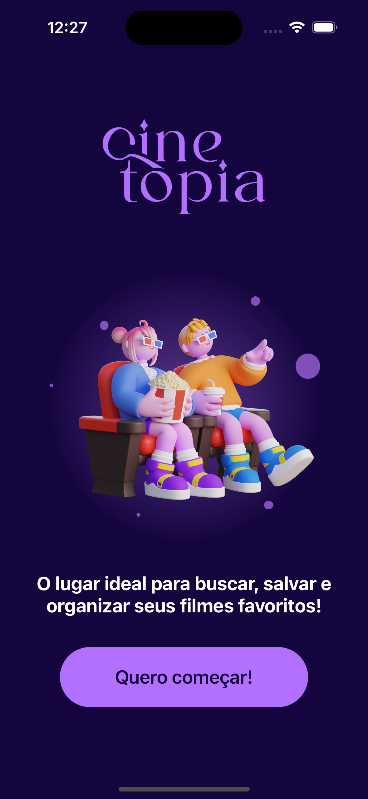
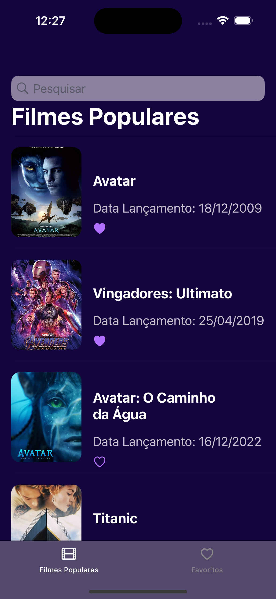
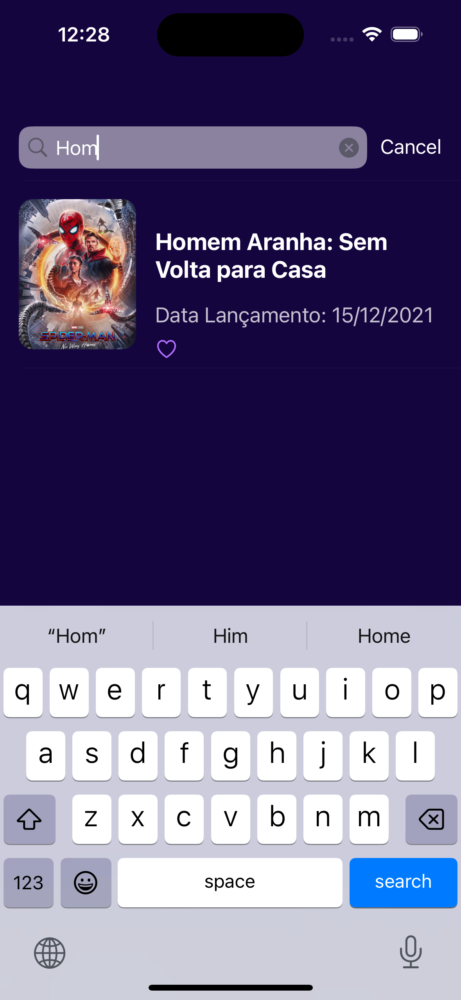
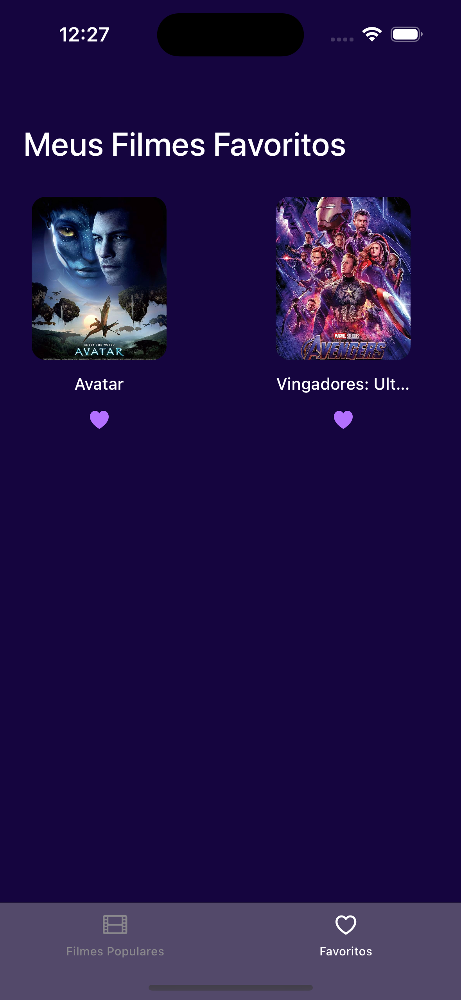

# Cinetopia - Aplicativo iOS

A aplicação Cinetopia é um aplicativo iOS que exibe a lista de filmes com maior arrecadação de bilheteria dos últimos tempos, utilizando a linguagem Swift e o framework UIKit, com a abordagem programática (view code).

 
    
    
    
    

## Recursos

- Listagem dos filmes com maior arrecadação de bilheteria dos últimos tempos;
- Exibição detalhada de um filme;
- Filtragem dos filmes de acordo com a busca do usuário;
- Favoritar/desfavoritar um filme.

## Técnicas e tecnologias

- UIKit: Framework para construção de interfaces de usuário;
- XCode: Ambiente de desenvolvimento integrado (IDE) oficial da Apple para desenvolvimento de aplicativos iOS;
- Swift: Linguagem de programação poderosa e intuitiva usada para desenvolver aplicativos iOS;
- View code: Abordagem programática para construção de interfaces de usuário, sem o uso de storyboards;
- `UINavigationController`: Utilizado para navegação entre telas;
- `UIButton, UIImageView, UILabel, UIStackView`: Componentes de interface de usuário para construção das telas.
- `UITableView`: Componente para construção de tabelas.
- `UICollectionView`: Componente construção de coleções (horizontal e vertical) usado para mostrar os filmes favoritos.
- `UITabBarController`: Menu inferior, que possibilita alternar entre telas e funcionalidades no projeto.
- `UITableViewDataSource`, `UITableViewDelegate`: Protocolos para construção de tabelas.
- `UISearchBar`, `UISearchBarDelegate`: Componente e protocolo para construção de barras de pesquisa.
- `UITableViewCell`: Construção de células para tabelas.
- `URLSession`: Classe que permite requisições HTTP.
- `Async/Await`: Funcionalidade que lida com operações assíncronas.
- `Cocoapods`: Gerenciador de dependências.
- `MVP`: Padrão arquitetural escolhido para refatorar o projeto.

## Requisitos

- iOS 13.0 ou posterior.
- Xcode 12.0 ou posterior.
- Conexão à internet.

## Como Usar

Quando você realizar o download do projeto, deverá descompactar o arquivo e entrar na pasta descompactada. Dentro dessa pasta, haverá um arquivo com a extensão `.xcodeproj`, você deve dar duplo clique nesse arquivo, que abrirá diretamente no XCode. 

Com o projeto aberto no XCode, você consegue visualizar todas as pastas e arquivos.

Para rodar o seu projeto, você deve clicar no botão de play na parte superior do XCode. Você também pode alterar o simulador em que o aplicativo será exibido, e então, o projeto será aberto no simulador de sua preferência.

## Créditos

Este projeto foi desenvolvido com base nas aulas fornecidas no curso [Desenvolva aplicativos iOS utilizando view code](https://cursos.alura.com.br/formacao-aplicativos-ios-view-code) da plataforma alura.

## Licença

Este aplicativo é distribuído sob a licença MIT.

---